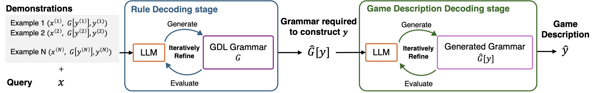

<div align="center">
<h1> Grammar-based Game Description Generation using Large Language Models </h3>

<h5 align="center">
    <a href="https://tsunehiko.github.io/">Tsunehiko Tanaka</a><sup>1</sup>&emsp;
    <a href="https://esslab.jp/~ess/ja/">Edgar Simo-Serra</a><sup>1</sup>&emsp;
    <br>
    <sup>1</sup>Waseda University
</h5>

<h3 align="center">
Transactions on Games, 2024
</h3>


[](https://arxiv.org/abs/2407.17404)
[](https://opensource.org/licenses/Apache-2.0)

</div>

This paper presents a novel framework that leverages Large Language Models (LLMs) to generate grammatically accurate game descriptions from natural language.



## Setup
1. Create Python environment and install dependencies
```bash
pip install torch==2.3.1 torchvision==0.18.1 torchaudio==2.3.1 --index-url https://download.pytorch.org/whl/cu121
pip install -r requirements.txt
pip install -e .
```

2. Build Java resource
```bash
mkdir ludii_java/libs
wget -P ludii_java/libs https://ludii.games/downloads/Ludii-1.3.13.jar

javac -cp ludii_java/libs/Ludii-1.3.13.jar:ludii_java/src \
      -d ludii_java/out \
      ludii_java/src/EvalLudiiGame.java \
      ludii_java/src/ComputeConcept.java \
      ludii_java/src/ComputeMultiAgents.java \
      ludii_java/src/ExtractExpand.java

jar cfm ./ludii_java/jars/EvalLudiiGame.jar ./ludii_java/manifest_eval.mf -C ludii_java/out .
jar cfm ./ludii_java/jars/ComputeConcept.jar ./ludii_java/manifest_concept.mf -C ludii_java/out .
jar cfm ./ludii_java/jars/ComputeMultiAgents.jar ./ludii_java/manifest_ma.mf -C ludii_java/out .
jar cfm ./ludii_java/jars/ExtractExpand.jar ./ludii_java/manifest_expand.mf -C ludii_java/out .
```

## Setup (Docker)
Before using Docker, ensure the following steps are completed:

1. Download the LLM model weights to `$HOME/.cache/huggingface/hub`. Make sure the directory exists and is accessible.

2. (Optional) Set your OpenAI API key in a `.env` file located in the project root directory. The file should contain the following format:
`OPENAI_API_KEY=your-api-key-here`

### Steps to Run Docker
1. Build a Docker image
```bash
./scripts/docker/build.sh
```

2. Attach a container to your shell
```bash
./scripts/docker/exec.sh
```

## Dataset Creation
1. Prepare expanded game descriptions
```bash
java -jar ludii_java/jars/ExtractExpand.jar
```

2. Create grammar files
```bash
python data/ludii/cache_grammar.py
```

## Run experiments
Grammar-based Game Description Generation (GGDG)
```bash
./scripts/grammar.sh
```

Game Description Generation (GDG)
```bash
./scripts/standard.sh
```

Evaluation
```
python ggdg/evaluation.py ${log_dir}
```

## Supervised Fine-Tuning (SFT)
Only models from Hugging Face are supported for SFT.

Dataset Creation
```bash
python sft/create_dataset.py --mode program --output_dataset_path ./sft/data/program.json
python sft/create_dataset.py --mode grammar --output_dataset_path ./sft/data/grammar.json
```

Run SFT
```bash
./sft/train.sh program meta-llama/Meta-Llama-3-8B-Instruct
./sft/train.sh grammar meta-llama/Meta-Llama-3-8B-Instruct
```

SFT+GGDG
```bash
./scripts/sft_grammar.sh meta-llama/Meta-Llama-3-8B-Instruct
```


## Supported LLMs
hf/{huggingface/model/name}
* meta-llama/Meta-Llama-3-8B-Instruct

openai/{model/name}
* openai/gpt-4o-mini

## Citation
```bibtex
@article{tanaka2024ggdg,
  author={Tanaka, Tsunehiko and Simo-Serra, Edgar},
  journal={IEEE Transactions on Games}, 
  title={Grammar-based Game Description Generation using Large Language Models}, 
  year={2024},
  pages={1-14},
}
```